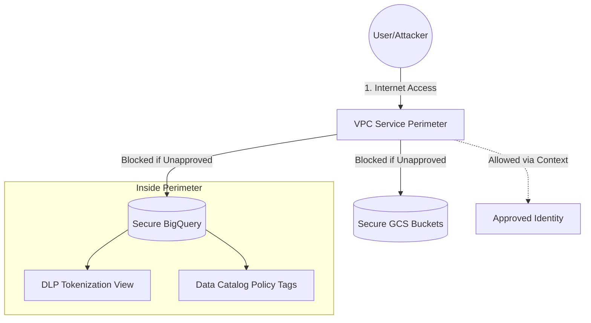

# 🛡️ Secure data environments in Google Cloud

## Overview

This repository contains a Terraform module to deploy the **"Secure data environments in Google Cloud"** reference architecture. This Proof of Concept (PoC) demonstrates how to secure massive datasets containing Personally Identifiable Information (PII) against accidental exposure, internal misconfigurations, and external exfiltration.

Standard identity-based access control (IAM) is not enough to secure critical data. If a developer accidentally grants public access to a bucket or table, the data is exposed. This architecture addresses that risk head-on by creating **hard network perimeters** that explicitly **override** permissive IAM settings.

---

## 🏗️ Architecture: The 4 Pillars of Defense

1.  **The Vault (VPC Service Controls):** A network-level "denial by default" boundary that blocks access from unauthorized networks, regardless of IAM roles.
2.  **Automated Encryption (KMS Autokey):** Policy-driven Customer Managed Encryption Keys (CMEK) automatically provisioned for all datasets and buckets via folder-level delegation.
3.  **Intelligent Shield (Cloud DLP):** Automated PII discovery and query-time tokenization (masking) within BigQuery views using native DLP SQL functions.
4.  **Defense-in-Depth (Data Catalog):** Column-level security using Policy Tags to ensure only authorized users see sensitive raw data like SSNs.

### Architecture Flow


## 🚀 Fast Track Deployment

### 1. Prerequisites
Ensure the identity running Terraform has the following roles at the **Organization** level:
*   `roles/accesscontextmanager.policyAdmin` (To manage the VPC-SC Perimeter)
*   `roles/orgpolicy.policyAdmin` (To allow the public bucket demonstration)
*   `roles/cloudkms.autokeyAdmin` (If using `folder_id` for KMS Autokey)

### 2. What you need locally
*   **Terraform ≥ 1.5**
*   **Google Cloud SDK** (`gcloud`)
*   **Python 3** (Used for the BigQuery DLP view helper script)

### 3. Configure & Deploy
1.  **Clone the repository:**
    ```bash
    git clone https://github.com/GCP-Architecture-Guides/data-security.git
    cd data-security
    ```
2.  **Initialize variables:**
    ```bash
    cp terraform.tfvars.example terraform.tfvars
    ```
3.  **Edit `terraform.tfvars`:** At a minimum, set your `project_id`, `organization_id`, and `allowed_user_identity`.
4.  **Authenticate and Apply:**
    ```bash
    gcloud auth application-default login
    terraform init
    terraform apply
    ```    

## 📖 The 8-Phase Demo Storyline

Follow this "Story Arc" to present the architecture's value. This script demonstrates how the system reacts to a vulnerability and how it protects data at rest using multiple layers of defense.

| Phase | Action | Outcome | The "So What?" |
| :--- | :--- | :--- | :--- |
| **1. The Vulnerability** | Show the `public-permissive-...` bucket permissions in the Console. | IAM shows `allUsers` has **Storage Object Viewer** (Public). | **The Risk:** Normally, this data is now leaked to the entire internet. |
| **2. The Attack** | Open the Object URL in an **Incognito** window or a non-corporate network. | **403 Forbidden:** Access is denied by VPC Service Controls. | **The Save:** The network perimeter overrides the "Public" IAM mistake. |
| **3. Approved Path** | Open the same URL from your **approved** session/corporate network. | **Success:** The CSV file downloads correctly. | Context-Aware Access allows verified users while blocking everyone else. Or user cloudshell gcloud storage cat gs://[FILE_PATH] |
| **4. Auto-Encryption** | Check BigQuery Table Details -> Encryption. | Shows **Customer-Managed Key (CMEK)** via Autokey. | Encryption is automated and enforced, not left to manual configuration. |
| **5. DLP Discovery** | Open **Sensitive Data Protection** in the Console. | Show the Inspect/De-identify templates created by Terraform. | The system classifies PII automatically without requiring manual toil. |
| **6. Tokenization** | Run `SELECT *` on the `pii_dlp_tokenized` view. | `ssn_tokenized` shows deterministic tokens (e.g., `abc-123`). | Analysts can join data using tokens without seeing raw sensitive values. |
| **7. Policy Tags** | Remove your "Fine-Grained Reader" role and query the raw table. | Sensitive columns (SSN/CC) now appear as `NULL`. | Even with database access, you can't see what you aren't "cleared" for. |


## 🧹 Cleanup & Teardown

To avoid ongoing costs and remove the demonstration infrastructure, follow these steps:

### 1. Disable Deletion Protection
By default, this PoC enables deletion protection on critical datasets. Before destroying, update your `terraform.tfvars`:
*   Set `bigquery_deletion_protection = false`
*   Set `bucket_force_destroy = true`

### 2. Destroy Infrastructure
From the root directory where you ran the apply, execute:
```bash
terraform destroy

### 3. Manual Post-Cleanup Checks
*   KMS KeyHandles: Autokey KeyHandles and their associated keys are not always fully deleted by the GCP API immediately. You may need to manually remove them or use terraform state rm if they block a clean destroy.

*   Access Context Manager: If create_access_policy was set to true, verify in the Console that the organization-level policy, access levels, and perimeter have been removed as intended.

*   Local Files: Delete the gitignored synthetic data file sample_pii_data.txt and any generated .autokey-config-patch.yaml files.

## 📜 License

This project is licensed under the **Apache License, Version 2.0**.

See the [LICENSE](LICENSE) file for the full license text.

> **Disclaimer:** This is a reference architecture for demonstration purposes. Users are responsible for configuring their own production-grade security controls and managing the costs associated with Google Cloud resources.
