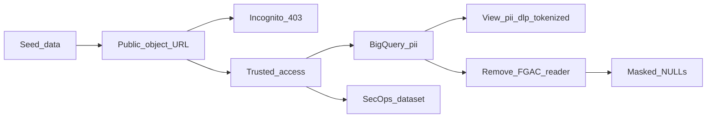

# Secure Data: The Invisible Data Perimeter

## Overview

This repository contains a Terraform module to deploy the **"Secure Data: The Invisible Data Perimeter"** reference architecture. This Proof of Concept (PoC) demonstrates how to secure massive datasets containing Personally Identifiable Information (PII) against accidental exposure, internal misconfigurations, and external exfiltration.

Standard identity-based access control (IAM) is not enough to secure critical data. If a developer accidentally grants public access to a bucket or table, the data is exposed. This architecture addresses that risk head-on by creating hard network perimeters that explicitly **override** permissive IAM settings.

### Single project and Autokey

Everything uses **`project_id`** only. With **`folder_id`** set, [`google_kms_autokey_config`](kms.tf) enables **delegated** Autokey: **`key_project_resolution_mode = "RESOURCE_PROJECT"`** (no separate **`key_project`**). Per Google’s **delegated key management** model ([Preview](https://cloud.google.com/products#product-launch-stages)), Autokey provisions CMEK **in the same project** as the protected resource.

When **`folder_id`** is set, [`autokey_keyhandles.tf`](autokey_keyhandles.tf) creates **`google_kms_key_handle`** resources (**`google-beta`**) for the warehouse dataset, SecOps dataset, and both GCS buckets, and wires **`default_encryption_configuration`** / bucket **`encryption`** to each handle’s **`kms_key`**. Set **`folder_id = null`** to skip Autokey and KeyHandles (BQ/GCS stay Google-managed). The **`pii_dlp_tokenized`** view still uses its **own** explicit CMEK in **`project_id`** ([`bigquery_dlp_tokenization.tf`](bigquery_dlp_tokenization.tf)). See [Enable Autokey](https://cloud.google.com/kms/docs/enable-autokey#delegated_key_management_with_terraform) and [Create protected resources](https://cloud.google.com/kms/docs/create-resource-with-autokey).

| Encryption (when **`folder_id`** is set) | What Terraform does |
|------------------------------------------|---------------------|
| **`secure_data_warehouse_*`** & **`secops_dashboard_*`** datasets | Default **CMEK** via Autokey KeyHandles (keys under `keyRings/autokey/...` in **`project_id`**) |
| **Raw** & **public demo** GCS buckets | Default **CMEK** via Autokey KeyHandles (same project) |
| **`pii_dlp_tokenized`** view | **Separate** CMEK ring/key in **`project_id`** ([`bigquery_dlp_tokenization.tf`](bigquery_dlp_tokenization.tf)), not Autokey |
| VPC-SC perimeter | Protects **`project_id`** only (single-project PoC) |

**Apply order:** [`demo_seed.tf`](demo_seed.tf) uploads [`fixtures/sample_pii_data.csv`](fixtures/sample_pii_data.csv) to both buckets and runs a **`google_bigquery_job`** load **before** [`google_access_context_manager_service_perimeter.invisible_boundary`](vpc_sc.tf) is created, so seeding does not run into VPC-SC. Folder Autokey ([`kms.tf`](kms.tf)) is **not** blocked on the perimeter for the same reason.

Removing KeyHandles from Terraform **does not delete** them in GCP; see [Cleanup](#cleanup).

## Usecases & Industry Context

Organizations frequently struggle with "shadow data"—sensitive information scattered across cloud environments. This architecture is vital for heavily regulated industries such as **Healthcare, Finance, and Retail**, where compromised credentials or accidental misconfigurations pose severe business and legal risks.

### The Business Challenge

- **Accidental Exposure:** Developers mistakenly assigning `allUsers` roles to buckets containing sensitive data.
- **Insider Threat:** Credentials compromised from trusted entities attempting to download datasets from non-corporate/untrusted networks.
- **Manual Toil:** The overhead of manually assigning and rotating Customer-Managed Encryption Keys (CMEK) for thousands of resources.

## Key Benefits

- **Zero-Trust Network Enforcement**: The network boundary actively overrides identity permissions. If a bucket is maliciously or accidentally made public, **VPC Service Controls ensures the data remains entirely inaccessible** to unapproved networks/devices/identities.
- **Automated Discovery**: Cloud DLP continuously discovers, classifies, and auto-tags PII across unstructured datasets without requiring full database scans, optimizing discovery costs.
- **Autokey on folder**: With **`folder_id`** set, [folder Autokey](kms.tf) uses **delegated** **`RESOURCE_PROJECT`** mode; [KeyHandles](autokey_keyhandles.tf) add **Autokey CMEK** on warehouse **BigQuery** / **GCS** in **`project_id`**. **`pii_dlp_tokenized`** uses a **separate CMEK** in **`project_id`**.
- **Context-Aware Access**: Allows granular bypasses to the perimeter. For example, a specific verified user identity (e.g., `presenter@your-company.com`) can seamlessly access the data, while blocking other traffic according to your access levels.
- **Query-Time Tokenization in BigQuery**: A saved **view** (`pii_dlp_tokenized`) uses native [DLP SQL functions](https://cloud.google.com/bigquery/docs/reference/standard-sql/dlp_functions) (`DLP_DETERMINISTIC_ENCRYPT` / `DLP_KEY_CHAIN`) so analysts can run `SELECT *` without pasting long SQL—deterministic tokens interoperable with Cloud DLP (AES-SIV style), separate from policy-tag masking.

## Architecture Components

- **VPC Service Controls (VPC-SC)**: Creates the "invisible vault" around the data.
- **Cloud Sensitive Data Protection (DLP)**: Inspect and **de-identification templates** for API-driven pipelines (e.g. character masking for SSN/Credit Card in `dlp.tf`), plus BigQuery-side tokenization via the `pii_dlp_tokenized` view (see below).
- **Cloud Key Management Service (KMS)**: [`google_kms_autokey_config`](kms.tf) with **`key_project_resolution_mode = "RESOURCE_PROJECT"`** when **`folder_id`** is set, plus [`autokey_keyhandles.tf`](autokey_keyhandles.tf) (**`google-beta`**) for BQ/GCS CMEK. **`pii_dlp_tokenized`** uses a **manually provisioned** symmetric key in **`project_id`** ([`bigquery_dlp_tokenization.tf`](bigquery_dlp_tokenization.tf)).
- **Access Context Manager**: Evaluates the specific context of an access request to determine if traffic can pass the VPC-SC perimeter.
- **Data Catalog & BigQuery Data Masking**: Applies "Defense in Depth" column-level security based on explicit Policy Tags.
- **Cloud Logging & BigQuery Log Router**: Routes perimeter violation events directly into a SecOps Dashboard dataset.
- **BigQuery & Cloud Storage**: The central data repositories secured within the restricted service perimeter.
- **Demo seed (Terraform)**: Committed CSV in **`fixtures/`** → GCS objects + BigQuery load job, applied **before** the VPC-SC perimeter exists ([`demo_seed.tf`](demo_seed.tf)).

---

## Deploy in your own environment

Use this section if you are cloning the repository into a **new** GCP organization or project.

### What you need in GCP

- A **GCP project** with **billing enabled**, under an **organization** (VPC-SC and some org policies assume org/folder context).
- Your **Organization ID** (numeric string used in Terraform as `organization_id`).
- Optional **Folder ID** for [KMS Autokey](kms.tf): folder that contains **`project_id`**. Enables delegated Autokey (**`RESOURCE_PROJECT`**) and KeyHandles on BQ/GCS. If `folder_id = null`, Autokey and KeyHandles are skipped.
- Access Context Manager: either let Terraform **create** a new org-level access policy (`create_access_policy = true`, default) or set `create_access_policy = false` and supply `access_policy_id`.
- **`allowed_user_identity`**: the demo user’s **email address only** (for example `alice@example.com`). Terraform adds the `user:` prefix in IAM bindings—do **not** include `user:` in `terraform.tfvars`.
- **IAM for whoever runs `terraform apply`**: the roles listed under [Prerequisites & IAM Permissions](#prerequisites--iam-permissions) (org-level, optional folder Autokey admin, project-level). Typically this is an **admin or CI service account**, not every demo viewer.

### What you need locally

- [Terraform](https://developer.hashicorp.com/terraform/install) **≥ 1.5** (see `required_version` in [main.tf](main.tf); tested around 1.8+).
- [Google Cloud SDK](https://cloud.google.com/sdk/docs/install) (`gcloud`) for credentials and for `bq` / `gsutil` in [scripts/setup_demo_data.sh](scripts/setup_demo_data.sh).
- **Python 3** on your `PATH` as `python3`. `terraform apply` invokes [scripts/dlp_wrapped_ciphertext_to_bq_bytes_literal.py](scripts/dlp_wrapped_ciphertext_to_bq_bytes_literal.py) via the HashiCorp **external** provider when building the BigQuery DLP view.

### Configure variables

1. `git clone <your-fork-or-repo-url>` and `cd` into the directory.
2. Copy the example tfvars and edit values:

   ```bash
   cp terraform.tfvars.example terraform.tfvars
   ```

3. Set at minimum **`project_id`**, **`organization_id`**, and **`allowed_user_identity`**. **`project_id` has no default** in [variables.tf](variables.tf); Terraform will error until it is set. See [terraform.tfvars.example](terraform.tfvars.example) and **[Variables reference](#variables-reference)** for **`folder_id`**, **`vpc_sc_name_suffix`**, etc.

### Authenticate

```bash
gcloud auth login
gcloud config set project YOUR_PROJECT_ID
gcloud auth application-default login
```

For automation, use a service account or Workload Identity instead of user ADC (advanced).

### Deploy

```bash
terraform init    # installs google / google-beta (5.x–7.x per constraint), random, external
terraform plan
terraform apply
terraform output
```

When you are finished, see **[Teardown and local cleanup](#teardown-and-local-cleanup)** (`terraform destroy`, scrubbing local files, org-level artifacts).

Review the plan carefully: with **`enable_public_exposure_demo = true`** (default), this PoC creates a **VPC-SC perimeter**, relaxes **`iam.allowedPolicyMemberDomains`** on the project ([`iam_policy.tf`](iam_policy.tf)), and grants **`allUsers`** on the demo bucket. For a **long-lived or internal** environment without that story, set **`enable_public_exposure_demo = false`**, **`bucket_force_destroy = false`**, and **`bigquery_deletion_protection = true`** in `terraform.tfvars` (see [Variables reference](#variables-reference)).

### QA (local)

From the repo root:

```bash
chmod +x scripts/qa.sh && ./scripts/qa.sh
```

This runs **`terraform fmt -check`**, **`terraform init`**, **`terraform validate`**, and **`shellcheck`** on shell scripts when `shellcheck` is installed.

### Demo data (included in `terraform apply`)

A **fixed synthetic CSV** ([`fixtures/sample_pii_data.csv`](fixtures/sample_pii_data.csv), 25 rows) is uploaded during apply to **`gs://…/pii/sample_pii_data.txt`** and **`gs://…/exposed/sample_pii_data.txt`**, and loaded into **`pii_dataset`** via **`google_bigquery_job`** ([`demo_seed.tf`](demo_seed.tf)). With **`enable_public_exposure_demo = false`**, the **`exposed/`** object still exists but the bucket stays **private** (no **`allUsers`**). The **VPC-SC service perimeter** is created **only after** those objects and the load job succeed, so you get a **single seamless `terraform apply`** without a manual pre-perimeter seed step.

### Optional: regenerate a larger sample (`setup_demo_data.sh`)

To replace data with **100 randomly generated rows** (writes local `sample_pii_data.txt`, re-uploads, and **`bq load`** from GCS), run from the repo root after apply:

```bash
./scripts/setup_demo_data.sh
```

Use the same identity you use for Terraform if **VPC-SC** is already enforced. The script loads from **GCS**, not a local file path, for compatibility with the perimeter.

### Teardown

```bash
terraform destroy
```

If **`create_access_policy`** was **true**, Terraform created an **organization-level** Access Context Manager policy. Confirm in the console (**VPC Service Controls** / **Access Context Manager**) that you are not leaving unused policies after destroy if your provider behavior or imports differ.

### Common failures

| Symptom | What to check |
|--------|----------------|
| Google provider auth errors | `gcloud auth application-default login`; quota project / `GOOGLE_APPLICATION_CREDENTIALS` if using a key |
| **`data.google_project`** **403** / CRM API disabled on a **new** project | Enable **`cloudresourcemanager.googleapis.com`** and **`serviceusage.googleapis.com`** on the project once (e.g. `gcloud services enable cloudresourcemanager.googleapis.com serviceusage.googleapis.com --project=YOUR_PROJECT_ID`), then re-run Terraform. |
| External / Python errors during apply | `python3 --version`; script path and execute permissions |
| Permission denied on APIs or IAM | Org/project roles in the next section; billing enabled |
| DLP / BigQuery region mismatches | Default `region` is `us-central1` in `variables.tf`; taxonomies and DLP templates use that region—change consistently if you change `region` |
| Access Policy **409** (already exists) | Set **`create_access_policy = false`**, set **`access_policy_id`**, then **`terraform import`** the existing policy and related access level / perimeter if names drift—see **`vpc_sc_name_suffix`** below |
| Access level or perimeter name mismatch after import | Set **`vpc_sc_name_suffix`** to the suffix in the live resource name (e.g. `corporate_network_SUFFIX`) so Terraform targets the same objects as [vpc_sc.tf](vpc_sc.tf) |
| **`google_kms_autokey_config`** **403** `VPC_SERVICE_CONTROLS` when changing Autokey | Folder Autokey updates use **`cloudkms.googleapis.com`** and can be blocked under VPC-SC. Apply from an allowed context, temporarily adjust **`restricted_services`** / use **`gcloud kms autokey-config update`**, then **`terraform refresh`**. |
| **`bq load`** **VPC_SERVICE_CONTROLS** from your laptop | Use [scripts/setup_demo_data.sh](scripts/setup_demo_data.sh) (loads from **GCS** inside the project) or run **`bq`** as an allowed identity; local-file loads often fail under VPC-SC. |
| **`google_storage_bucket_iam_member`** **412** / “permitted customer” right after apply | Org policy **`iam.allowedPolicyMemberDomains`** can take time to apply before **`allUsers`** bindings; wait and **`terraform apply`** again (or add the binding once policy is effective). |
| Delegated Autokey / **`RESOURCE_PROJECT`** unavailable | Same-project Autokey is **[Preview](https://cloud.google.com/products#product-launch-stages)**; confirm org eligibility and APIs. If blocked, set **`folder_id = null`** to deploy without Autokey KeyHandles. |

---

## Deployment Guide

### Prerequisites & IAM Permissions

Deploying this PoC requires manipulating Organization Policies, VPC Service Controls, and KMS Autokey configurations—actions that inherently require high-level administrative access.

**The user running `terraform apply` MUST ALREADY have the following targeted permissions**, either granted directly or inherited, *before* beginning deployment. We do not require full Organization Admin, but rather the principles of least privilege for the specific services we are touching:

#### 1. Organization-Level Roles

These must be granted at the Organization node (`organizations/YOUR_ORG_ID`):

- `roles/accesscontextmanager.policyAdmin` (To create the VPC-SC Access Policy, Access Level, and Service Perimeter)
- `roles/orgpolicy.policyAdmin` (To modify the Organization Policy to override Domain Restricted Sharing for the public bucket demonstration)

#### 2. Folder-Level Roles

- `roles/cloudkms.autokeyAdmin` (To configure KMS Autokey on the folder—only if you set `folder_id`)

#### 3. Project-Level Roles

On **your project** (`project_id` / `YOUR_PROJECT_ID`):

- `roles/resourcemanager.projectIamAdmin` (Terraform grants IAM on KMS keys, including the DLP tokenization key)
- `roles/storage.admin` (To create buckets and manage their immediate IAM policies)
- `roles/bigquery.admin` (To create datasets, tables, and views—including the DLP tokenization view)
- `roles/cloudkms.admin` (DLP tokenization key ring/key in [`bigquery_dlp_tokenization.tf`](bigquery_dlp_tokenization.tf); Autokey-provisioned keys under `keyRings/autokey/` when **`folder_id`** is set; IAM on those keys. Alternatively a custom role with the needed `cloudkms.*` permissions and IAM bindings.)
- `roles/dlp.admin` (To create the Inspect and De-identification Templates)
- `roles/datacatalog.admin` (To create the Data Sensitivity Taxonomy and Policy Tags)
- `roles/logging.configWriter` (To create the Cloud Logging Sink for the SecOps Dashboard)

**BigQuery warehouse users (when `folder_id` is set):** Terraform grants **`roles/cloudkms.cryptoKeyDecrypter`** on the Autokey warehouse dataset key to **`allowed_user_identity`** so `SELECT` on CMEK-backed tables works. Add the same (or equivalent) on that Autokey key for other analysts.

**BigQuery DLP view users:** Terraform grants **`roles/cloudkms.cryptoKeyEncrypterDecrypter`** on the **DLP tokenization** KMS key to **`allowed_user_identity`**. Anyone else who should run `SELECT` on **`pii_dlp_tokenized`** needs the same (or equivalent) on that key **and** BigQuery access to the underlying **`pii_dataset`** (including Data Catalog fine-grained reader for policy-tagged columns, if applicable).

**Seeing unmasked sensitive columns (`ssn`, `credit_card`) in `pii_dataset`:** In addition to BigQuery dataset access, callers need fine-grained policy-tag visibility—for this PoC, Terraform grants **`allowed_user_identity`** **`roles/datacatalog.categoryFineGrainedReader`** on the taxonomy and **`roles/bigquerydatapolicy.maskedReader`** on the masking policy. See also [Data Catalog fine-grained](https://cloud.google.com/bigquery/docs/column-level-security) and [BigQuery data policies](https://cloud.google.com/bigquery/docs/managed-protector-manage-data-policies).

### Variables reference

| Variable | Required | Default / notes |
|----------|----------|-----------------|
| **`project_id`** | Yes | GCP project where BigQuery, Storage, DLP, logging, and most resources live. |
| **`organization_id`** | Yes | Numeric org ID for Access Context Manager and VPC-SC. |
| **`allowed_user_identity`** | Yes | Demo user email only (no `user:` prefix); used for perimeter ingress and several IAM bindings. |
| **`region`** | No | `us-central1`; keep DLP, Data Catalog, and KMS key ring aligned if you change it. |
| **`folder_id`** | No | `null` skips Autokey and KeyHandles. If set, folder Autokey uses **`RESOURCE_PROJECT`** (keys in **`project_id`**) and BQ/GCS get Autokey CMEK via [`autokey_keyhandles.tf`](autokey_keyhandles.tf). |
| **`vpc_sc_name_suffix`** | No | `null` → suffix matches [`random_id.suffix`](main.tf) (same as bucket/dataset name suffixes). Set explicitly (e.g. after **`terraform import`**) if your live **Access Level** / **Service Perimeter** names use another suffix. |
| **`create_access_policy`** | No | `true` creates a new org-level access policy; `false` requires **`access_policy_id`**. |
| **`access_policy_id`** | If not creating | Empty when `create_access_policy = true`; set the numeric policy ID when reusing an existing policy. |
| **`billing_account_id`** | No | Declared in [variables.tf](variables.tf) for optional extensions; **current root module resources do not reference it**—associate billing in the console or another stack if needed. |
| **`enable_public_exposure_demo`** | No | `true` (default): relax domain-restricted sharing for the project, grant **`allUsers`** on the demo bucket, and add anonymous **US/CA** to the access level (public HTTPS walkthrough). `false`: keep the demo bucket **private** and tighten the access level to **`allowed_user_identity`** only (baseline CSV is still written under **`exposed/`** for a consistent apply graph). |
| **`bucket_force_destroy`** | No | `true` (default PoC): allow `terraform destroy` to delete non-empty buckets. `false` recommended for environments where emptying buckets manually is required before destroy. |
| **`bigquery_deletion_protection`** | No | `false` (default): disposable tables. `true`: API deletion protection on **`pii_dataset`** and **`pii_dlp_tokenized`**. SecOps **`delete_contents_on_destroy`** is disabled when `true` (emptying on destroy). BigQuery **datasets** are not given Terraform `prevent_destroy` here so the root module stays compatible with Terraform versions that disallow variables in `lifecycle` blocks. |

### Deployment Steps (summary)

1. **Initialize Terraform:** `terraform init`
2. **Plan / apply** with your `terraform.tfvars` or `-var` flags (see [Variables reference](#variables-reference)).
3. **Outputs:** `terraform output` (includes `bigquery_dlp_tokenized_view`, `kms_dlp_tokenization_key`, bucket names).
4. **Demo rows** are loaded by apply (see [Demo data](#demo-data-included-in-terraform-apply)). Optionally run **`./scripts/setup_demo_data.sh`** for a larger random sample.

---

## PoC walkthrough — detailed steps

Follow this sequence after **`terraform apply`** ( **`pii_dataset`** and demo GCS objects are already seeded). Replace placeholders using `terraform output`.

### Before you start

- Log into the GCP Console as **`allowed_user_identity`** for phases that require policy-tag visibility or KMS-backed DLP in BigQuery.
- Collect names once:

  ```bash
  terraform output -raw project_id
  terraform output -raw public_permissive_bucket
  terraform output -raw raw_ingestion_bucket
  terraform output -raw bigquery_dataset_id
  terraform output -raw bigquery_dlp_tokenized_view
  ```

  Buckets look like `public-permissive-demo-XXXXXXXX` and datasets like `secure_data_warehouse_XXXXXXXX`.

### Step A — Confirm demo data (optional refresh)

**`terraform apply`** already seeds **`pii_dataset`** and both bucket paths from [`fixtures/sample_pii_data.csv`](fixtures/sample_pii_data.csv). To refresh with **100 random rows**, run `./scripts/setup_demo_data.sh`.

### Step B — Phase 2–3: Public bucket and VPC-SC block

Skip this step if **`enable_public_exposure_demo`** is **`false`** (no **`allUsers`**, no anonymous **US/CA** clause in the access level; the **`exposed/`** object may still exist but is not publicly readable).

1. In the Console open **Cloud Storage** → bucket **`public-permissive-demo-...`**.
2. Open the **Permissions** tab. Show that **`allUsers`** has **Storage Object Viewer** (intentionally dangerous IAM for the story).
3. Build the HTTPS URL (use your bucket name and path `exposed/sample_pii_data.txt`):

   `https://storage.googleapis.com/BUCKET_NAME/exposed/sample_pii_data.txt`

4. **Phase 3:** In an **Incognito** window (or off-VPN / mobile), open that URL. Expect **403** with a **VPC Service Controls** denial (e.g. `VPC_SERVICE_CONTROLS_VIOLATION` / request denied).

### Step C — Phase 4: Approved access

On a trusted path, open the same URL or download the object from the Console. With the default demo access level, **US/CA** anonymous access or **`allowed_user_identity`** can succeed; with **`enable_public_exposure_demo = false`**, only **`allowed_user_identity`** (and other IAM you add) applies.

### Step D — Phase 5: Encryption (Autokey context)

1. Open **BigQuery** → your project → dataset **`secure_data_warehouse_...`**.
2. Open table **`pii_dataset`** → **Details** → **Encryption**.
3. With **`folder_id`** set, the dataset uses **customer-managed** encryption via **Autokey** (KeyHandle). With **`folder_id = null`**, encryption is **Google-managed**. Show folder **Autokey** config (**delegated** / **`RESOURCE_PROJECT`** when enabled). **`pii_dlp_tokenized`** uses a **separate** customer-managed DLP key (`terraform output -raw kms_dlp_tokenization_key`).

### Step E — Phase 6: DLP templates and tokenized view

1. Open **Google Cloud** → **Security** → **Sensitive Data Protection** (console naming may vary).
2. Show the **inspect** and **de-identify** templates in the same **region** as `var.region` (default `us-central1`), matching `dlp.tf`.
3. Back in **BigQuery**, open dataset **`secure_data_warehouse_...`** → **Views** → **`pii_dlp_tokenized`** → **Query** or open in editor:

   ```sql
   SELECT * FROM `PROJECT.DATASET.pii_dlp_tokenized`;
   ```

   Use `terraform output -raw bigquery_dlp_tokenized_view` for the fully qualified id.

4. Point out **`ssn_tokenized`** and **`credit_card_tokenized`** (deterministic tokens, not the same as policy-tag `NULL` masking).

### Step F — Phase 7: Policy-tag masking

1. Run `SELECT *` on **`pii_dataset`**; confirm **`ssn`** and **`credit_card`** are visible with fine-grained roles.
2. **IAM & Admin** → **IAM** → find your user → **Edit** principal → remove **Data Catalog Fine-Grained Reader** (`roles/datacatalog.categoryFineGrainedReader`) for the demo (or the binding Terraform created on the taxonomy).
3. Re-run the same query on **`pii_dataset`**; sensitive columns should appear as **`NULL`**.
4. **Restore** the role after the demo.

### Step G — Phase 8: SecOps dataset

1. In **BigQuery**, open dataset **`secops_dashboard_...`** (CMEK via Autokey when **`folder_id`** is set).
2. Inspect tables such as **`cloudaudit_googleapis_com_policy_*`** fed by the logging sink (naming may vary slightly by date).

### Flow overview



---

## Demo Script: Optional larger sample (`setup_demo_data.sh`)

**Default:** [`demo_seed.tf`](demo_seed.tf) + [`fixtures/sample_pii_data.csv`](fixtures/sample_pii_data.csv) run during **`terraform apply`** (before VPC-SC). No script required for the baseline demo.

**Optional:** Python generates **100** random rows and overwrites the same GCS keys and **`pii_dataset`**:

1. Ensure Python 3 is installed.
2. From the repository root after **`terraform apply`** (initialized Terraform; local state file or remote backend):

   ```bash
   ./scripts/setup_demo_data.sh
   ```

**The script** writes gitignored `sample_pii_data.txt`, uploads to both buckets, and **`bq load`** from **`gs://…/pii/sample_pii_data.txt`**.

---

## BigQuery DLP tokenization (saved view)

Terraform provisions a BigQuery **view** named **`pii_dlp_tokenized`** in the same dataset as `pii_dataset`. The SQL is stored in BigQuery: open **Views** under `secure_data_warehouse_*`, or run:

```sql
SELECT * FROM `YOUR_PROJECT_ID.secure_data_warehouse_*.pii_dlp_tokenized`;
```

Use `terraform output -raw bigquery_dlp_tokenized_view` for the exact `project.dataset.view` id.

**Apply-time requirement:** Fresh `terraform apply` needs **Python 3** available as `python3` for the wrapped-key BYTES literal helper used by the view ([bigquery_dlp_tokenization.tf](bigquery_dlp_tokenization.tf), [scripts/dlp_wrapped_ciphertext_to_bq_bytes_literal.py](scripts/dlp_wrapped_ciphertext_to_bq_bytes_literal.py)).

**What it does:** For each row, it reads `ssn` and `credit_card` from `pii_dataset` and exposes **`ssn_tokenized`** and **`credit_card_tokenized`** using **`DLP_DETERMINISTIC_ENCRYPT`** and **`DLP_KEY_CHAIN`**, as described in [DLP encryption functions](https://cloud.google.com/bigquery/docs/reference/standard-sql/dlp_functions).

**How this relates to `dlp.tf`:** The **De-identification Template** uses **character masking** for API-driven jobs. The **view** uses **BigQuery SQL DLP functions** and a **dedicated KMS key** (`terraform output -raw kms_dlp_tokenization_key`).

**Optional (decrypt in trusted workflows):** **`DLP_DETERMINISTIC_DECRYPT`** with the same **`DLP_KEY_CHAIN(...)`** and context strings (`poc-ssn-v1` / `poc-cc-v1`) per product documentation and your governance rules.

---

## The Presentation Runbook (The 8-Phase Flow)

This is the **story arc** for presenters. Use **[PoC walkthrough — detailed steps](#poc-walkthrough--detailed-steps)** for click-level instructions.

### Phase 1: The Context

Explain that the architecture uses more than IAM: a Zero-Trust-style **service perimeter** underneath identity.

### Phase 2: The Vulnerability (IAM Failure)

Show the **`public-permissive-demo-...`** bucket **Permissions**: `allUsers` with **Object Viewer**.

### Phase 3: The Attack & The Defense (VPC-SC)

From an unapproved context, open the object URL; expect **403** / **VPC_SERVICE_CONTROLS_VIOLATION**. Message: IAM mistake does not equal worldwide readable data.

### Phase 4: The Approved Access

From an approved context (region / identity per your access level and ingress policy), show successful access.

### Phase 5: Encryption & Autokey

Show **Autokey CMEK** on the warehouse dataset when **`folder_id`** is set (else **Google-managed**), delegated Autokey on the folder, and **customer-managed** **`pii_dlp_tokenized`** (DLP key).

### Phase 6: Automated Discovery & Tokenization (DLP)

**Sensitive Data Protection** templates + BigQuery **`pii_dlp_tokenized`** tokens vs **Phase 7** NULL masking.

### Phase 7: Defense in Depth (Policy Tags)

**`pii_dataset`**: remove **Data Catalog Fine-Grained Reader** temporarily; **`ssn`** / **`credit_card`** become **`null`**; restore the role after.

### Phase 8: SecOps Visibility

**`secops_dashboard_*`** (CMEK via Autokey when **`folder_id`** is set) and audit tables for blocked / policy events.

---

## Publishing this repository (maintainers)

Before making the repo public:

1. **Never commit** `terraform.tfstate`, secrets, or real **`terraform.tfvars`**. This repo’s **`.gitignore`** excludes common Terraform and log patterns; keep **`terraform.tfvars.example`** as the template. **`fixtures/sample_pii_data.csv`** is **synthetic** demo data (safe to ship); do not replace it with real PII.
2. Prefer a **remote backend** (GCS or Terraform Cloud) for state in real teams—not local state.
3. **`git grep`** (or IDE search) for organization IDs, folder IDs, emails, and project IDs in tracked files. Local Autokey patches belong in **`.autokey-config-patch.yaml`** (gitignored); the repo ships **[`autokey-config-patch.example.yaml`](autokey-config-patch.example.yaml)** as a placeholder-only template.
4. If state or logs **ever** entered Git history, treat resource metadata as exposed; consider **`git filter-repo`** or a fresh repo, and rotate or rebuild sensitive KMS material as appropriate.
5. This repo ships with the **Apache License 2.0** ([LICENSE](LICENSE)). Optionally add **`SECURITY.md`** for vulnerability reporting.

---

## License

This project is licensed under the **Apache License, Version 2.0**. See [LICENSE](LICENSE).

---

## Teardown and local cleanup

### Destroy infrastructure

From the directory that holds your Terraform configuration and state (same place you ran **`apply`**):

```bash
terraform destroy
```

Review the plan, then confirm. If **`bucket_force_destroy`** was **`false`**, empty buckets (or temporarily set **`force_destroy`**) before destroy succeeds. If **`bigquery_deletion_protection`** was **`true`**, set it back to **`false`** (or drop protection in the console) so tables can be removed.

### After destroy

1. **Org console:** If you used **`create_access_policy = true`**, decide whether to delete the **Access Context Manager** policy, **access levels**, and **service perimeter** created for this PoC (they live under your organization, not only the project).
2. **Local secrets and IDs:** Remove or never commit **`terraform.tfvars`** (real **`project_id`**, **`organization_id`**, **`folder_id`**, **`allowed_user_identity`**). Prefer **`terraform.tfvars.example`** only in Git.
3. **State files:** If you used **local state**, you may delete **`terraform.tfstate`** and **`terraform.tfstate*.backup`** after a successful destroy to drop old lineage and outputs from disk; run **`terraform init`** before the next **`apply`**. Remote backends should be emptied or deleted per your team’s policy.
4. **Generated demo file:** Delete gitignored **`sample_pii_data.txt`** if you ran **`scripts/setup_demo_data.sh`**.
5. **Autokey patch:** The file **`.autokey-config-patch.yaml`** is **gitignored**—delete it or overwrite from **[`autokey-config-patch.example.yaml`](autokey-config-patch.example.yaml)** so no real folder or project IDs remain on disk.

### GCP leftovers (Autokey / KMS)

**Autokey KeyHandles** and their crypto keys are **not always fully deleted** when Terraform destroys handle resources (GCP may retain keys per product rules). You may need **`terraform state rm`** for stuck handles, or manual cleanup in **Cloud KMS** / support guidance. See [Google’s Autokey Terraform guidance](https://cloud.google.com/kms/docs/create-resource-with-autokey#create-and-destroy-patterns-in-terraform). **CMEK-backed** BigQuery datasets and buckets can block destroy until emptied or encryption is changed—plan teardown accordingly.
