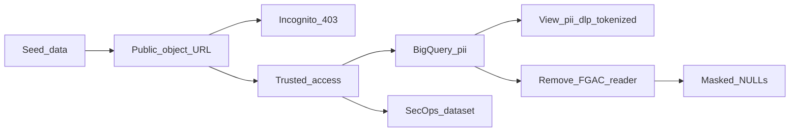

# Secure Data: The Invisible Data Perimeter

## Overview

This repository contains a Terraform module to deploy the **"Secure Data: The Invisible Data Perimeter"** reference architecture. This Proof of Concept (PoC) demonstrates how to secure massive datasets containing Personally Identifiable Information (PII) against accidental exposure, internal misconfigurations, and external exfiltration.

Standard identity-based access control (IAM) is not enough to secure critical data. If a developer accidentally grants public access to a bucket or table, the data is exposed. This architecture addresses that risk head-on by creating hard network perimeters that explicitly **override** permissive IAM settings.

## Usecases & Industry Context

Organizations frequently struggle with "shadow data"—sensitive information scattered across cloud environments. This architecture is vital for heavily regulated industries such as **Healthcare, Finance, and Retail**, where compromised credentials or accidental misconfigurations pose severe business and legal risks.

### The Business Challenge

- **Accidental Exposure:** Developers mistakenly assigning `allUsers` roles to buckets containing sensitive data.
- **Insider Threat:** Credentials compromised from trusted entities attempting to download datasets from non-corporate/untrusted networks.
- **Manual Toil:** The overhead of manually assigning and rotating Customer-Managed Encryption Keys (CMEK) for thousands of resources.

## Key Benefits

- **Zero-Trust Network Enforcement**: The network boundary actively overrides identity permissions. If a bucket is maliciously or accidentally made public, **VPC Service Controls ensures the data remains entirely inaccessible** to unapproved networks/devices/identities.
- **Automated Discovery**: Cloud DLP continuously discovers, classifies, and auto-tags PII across unstructured datasets without requiring full database scans, optimizing discovery costs.
- **Hands-Free Encryption**: Cloud KMS Autokey eliminates manual toil by automating the creation, assignment, and rotation of encryption keys across services before they handle data.
- **Context-Aware Access**: Allows granular bypasses to the perimeter. For example, a specific verified user identity (e.g., `presenter@your-company.com`) can seamlessly access the data, while blocking other traffic according to your access levels.
- **Query-Time Tokenization in BigQuery**: A saved **view** (`pii_dlp_tokenized`) uses native [DLP SQL functions](https://cloud.google.com/bigquery/docs/reference/standard-sql/dlp_functions) (`DLP_DETERMINISTIC_ENCRYPT` / `DLP_KEY_CHAIN`) so analysts can run `SELECT *` without pasting long SQL—deterministic tokens interoperable with Cloud DLP (AES-SIV style), separate from policy-tag masking.

## Architecture Components

- **VPC Service Controls (VPC-SC)**: Creates the "invisible vault" around the data.
- **Cloud Sensitive Data Protection (DLP)**: Inspect and **de-identification templates** for API-driven pipelines (e.g. character masking for SSN/Credit Card in `dlp.tf`), plus BigQuery-side tokenization via the `pii_dlp_tokenized` view (see below).
- **Cloud Key Management Service (KMS)**: **Autokey** automates CMEK for BigQuery and Cloud Storage; a **dedicated KMS key** in the same region as BigQuery backs `DLP_KEY_CHAIN` for the tokenization view (wrapped DEK is reflected in Terraform state—**treat state as sensitive**).
- **Access Context Manager**: Evaluates the specific context of an access request to determine if traffic can pass the VPC-SC perimeter.
- **Data Catalog & BigQuery Data Masking**: Applies "Defense in Depth" column-level security based on explicit Policy Tags.
- **Cloud Logging & BigQuery Log Router**: Routes perimeter violation events directly into a SecOps Dashboard dataset.
- **BigQuery & Cloud Storage**: The central data repositories secured within the restricted service perimeter.

---

## Deploy in your own environment

Use this section if you are cloning the repository into a **new** GCP organization or project.

### What you need in GCP

- A **GCP project** with **billing enabled**, under an **organization** (VPC-SC and some org policies assume org/folder context).
- Your **Organization ID** (numeric string used in Terraform as `organization_id`).
- Optional **Folder ID** for [KMS Autokey](kms.tf): set `folder_id` in `terraform.tfvars`. If you set `folder_id = null`, `google_kms_autokey_config` is **not** created (see the `count` in `kms.tf`).
- Access Context Manager: either let Terraform **create** a new org-level access policy (`create_access_policy = true`, default) or set `create_access_policy = false` and supply `access_policy_id`.
- **`allowed_user_identity`**: the demo user’s **email address only** (for example `alice@example.com`). Terraform adds the `user:` prefix in IAM bindings—do **not** include `user:` in `terraform.tfvars`.
- **IAM for whoever runs `terraform apply`**: the roles listed under [Prerequisites & IAM Permissions](#prerequisites--iam-permissions) (org-level, optional folder Autokey admin, project-level). Typically this is an **admin or CI service account**, not every demo viewer.

### What you need locally

- [Terraform](https://developer.hashicorp.com/terraform/install) (1.x; tested around 1.8+).
- [Google Cloud SDK](https://cloud.google.com/sdk/docs/install) (`gcloud`) for credentials and for `bq` / `gsutil` in [scripts/setup_demo_data.sh](scripts/setup_demo_data.sh).
- **Python 3** on your `PATH` as `python3`. `terraform apply` invokes [scripts/dlp_wrapped_ciphertext_to_bq_bytes_literal.py](scripts/dlp_wrapped_ciphertext_to_bq_bytes_literal.py) via the HashiCorp **external** provider when building the BigQuery DLP view.

### Configure variables

1. `git clone https://github.com/GCP-Architecture-Guides/data-security.git` and `cd` into the directory 'data-security'.
2. Copy the example tfvars and edit values:

   ```bash
   cp terraform.tfvars.example terraform.tfvars
   ```

3. Set at minimum **`project_id`**, **`organization_id`**, and **`allowed_user_identity`**. **`project_id` has no default** in [variables.tf](variables.tf); Terraform will error until it is set.

```bash
  # set the create_access_policy = true (default) #create a new org-level Access Context Manager policy for this PoC, if set to false, then provide the existing access policy id
  # access_policy_id     = "XXXX"
   ```

### Authenticate

```bash
gcloud auth login
gcloud config set project YOUR_PROJECT_ID
gcloud auth application-default login
```

For automation, use a service account or Workload Identity instead of user ADC (advanced).

### Deploy

```bash
terraform init    # installs google, google-beta, random, external
terraform plan
terraform apply
terraform output
```

Review the plan carefully: this PoC creates a **VPC-SC perimeter**, modifies **org/project policies** for the demo (see `iam_policy.tf`), and creates public IAM on a **demo** bucket by design.

### Load synthetic demo data

From the repository root (with `terraform.tfstate` present):

```bash
chmod +x /scripts/setup_demo_data.sh
./scripts/setup_demo_data.sh
```

This generates `sample_pii_data.txt`, uploads to the raw and “public” buckets (`pii/` and `exposed/` prefixes), and loads into `pii_dataset`.

### Teardown

```bash
terraform destroy
```

If **`create_access_policy`** was **true**, Terraform created an **organization-level** Access Context Manager policy. Confirm in the console (**VPC Service Controls** / **Access Context Manager**) that you are not leaving unused policies after destroy if your provider behavior or imports differ.

### Common failures

| Symptom | What to check |
|--------|----------------|
| Google provider auth errors | `gcloud auth application-default login`; quota project / `GOOGLE_APPLICATION_CREDENTIALS` if using a key |
| External / Python errors during apply | `python3 --version`; script path and execute permissions |
| Permission denied on APIs or IAM | Org/project roles in the next section; billing enabled |
| DLP / BigQuery region mismatches | Default `region` is `us-central1` in `variables.tf`; taxonomies and DLP templates use that region—change consistently if you change `region` |

---

## Deployment Guide

### Prerequisites & IAM Permissions

Deploying this PoC requires manipulating Organization Policies, VPC Service Controls, and KMS Autokey configurations—actions that inherently require high-level administrative access.

**The user running `terraform apply` MUST ALREADY have the following targeted permissions**, either granted directly or inherited, *before* beginning deployment. We do not require full Organization Admin, but rather the principles of least privilege for the specific services we are touching:

#### 1. Organization-Level Roles

These must be granted at the Organization node (`organizations/YOUR_ORG_ID`):

- `roles/accesscontextmanager.policyAdmin` (To create the VPC-SC Access Policy, Access Level, and Service Perimeter)
- `roles/orgpolicy.policyAdmin` (To modify the Organization Policy to actively enforce KMS Autokey and override Domain Restricted Sharing for the public bucket demonstration)

#### 2. Folder-Level Roles

- `roles/cloudkms.autokeyAdmin` (To configure the KMS Autokey at the folder level so the project can automatically request keys—only if you set `folder_id`)

#### 3. Project-Level Roles

These must be granted on **your** target project (`YOUR_PROJECT_ID`):

- `roles/resourcemanager.projectIamAdmin` (To allow Terraform to grant the `cloudkms.admin` role to the Autokey Service Agent)
- `roles/storage.admin` (To create buckets and manage their immediate IAM policies)
- `roles/bigquery.admin` (To create datasets, tables, and views—including the DLP tokenization view)
- `roles/cloudkms.admin` (To create the KMS key ring and crypto key used by `DLP_KEY_CHAIN` in the `pii_dlp_tokenized` view; alternatively a custom role with `cloudkms.keyRings.create`, `cloudkms.cryptoKeys.create`, and IAM bindings on the key)
- `roles/dlp.admin` (To create the Inspect and De-identification Templates)
- `roles/datacatalog.admin` (To create the Data Sensitivity Taxonomy and Policy Tags)
- `roles/logging.configWriter` (To create the Cloud Logging Sink for the SecOps Dashboard)

**BigQuery DLP view users:** Terraform grants `roles/cloudkms.cryptoKeyEncrypterDecrypter` on the tokenization KMS key to `allowed_user_identity`. Anyone else who should run `SELECT` on `pii_dlp_tokenized` needs the same (or equivalent) access on that key **and** BigQuery access to the underlying `pii_dataset` (including Data Catalog fine-grained reader for policy-tagged columns, if applicable).

**Seeing unmasked sensitive columns (`ssn`, `credit_card`) in `pii_dataset`:** In addition to BigQuery dataset access, callers need fine-grained policy-tag visibility—for this PoC, Terraform grants **`allowed_user_identity`** **`roles/datacatalog.categoryFineGrainedReader`** on the taxonomy and **`roles/bigquerydatapolicy.maskedReader`** on the masking policy. See also [Data Catalog fine-grained](https://cloud.google.com/bigquery/docs/column-level-security) and [BigQuery data policies](https://cloud.google.com/bigquery/docs/managed-protector-manage-data-policies).

### Variables Configuration

Before deploying, determine the values for the required variables:

- **`project_id`** (required): ID of the GCP project; set in `terraform.tfvars` or `-var`.
- **`organization_id`**: Your GCP Organization ID.
- **`access_policy_id`**: The numeric ID of an existing Access Policy, if `create_access_policy` is `false`.
- **`allowed_user_identity`**: Email of the user allowed through the perimeter for the demo (no `user:` prefix).
- **`folder_id`** (optional): Folder ID for KMS Autokey; use `null` to skip.

### Deployment Steps (summary)

1. **Initialize Terraform:** `terraform init`
2. **Plan / apply** with your `terraform.tfvars` or `-var` flags.
3. **Outputs:** `terraform output` (includes `bigquery_dlp_tokenized_view`, `kms_dlp_tokenization_key`, bucket names).

---

## PoC walkthrough — detailed steps

Follow this sequence after **`terraform apply`** and optionally **`./scripts/setup_demo_data.sh`**. Replace placeholders using `terraform output`.

### Before you start

- Log into the GCP Console as **`allowed_user_identity`** for phases that require policy-tag visibility or KMS-backed DLP in BigQuery.
- Collect and save the names once:

  ```bash
echo "project_id: $(terraform output -raw project_id)"
echo "public_permissive_bucket: $(terraform output -raw public_permissive_bucket)"
echo "raw_ingestion_bucket: $(terraform output -raw raw_ingestion_bucket)"
echo "bigquery_dataset_id: $(terraform output -raw bigquery_dataset_id)"
echo "bigquery_dlp_tokenized_view: $(terraform output -raw bigquery_dlp_tokenized_view)"
  ```

  Buckets look like `public-permissive-demo-XXXXXXXX` and datasets like `secure_data_warehouse_XXXXXXXX`.

### Step A — Seed data (if not done)

Run `./scripts/setup_demo_data.sh` from the repo root. Objects are written to:

- `gs://RAW_BUCKET/pii/sample_pii_data.txt`
- `gs://PUBLIC_BUCKET/exposed/sample_pii_data.txt`

### Step B — Phase 2–3: Public bucket and VPC-SC block

1. In the Console open **Cloud Storage** → bucket **`public-permissive-demo-...`**.
2. Open the **Permissions** tab. Show that **`allUsers`** has **Storage Object Viewer** (intentionally dangerous IAM for the story).
3. Build the HTTPS URL (use your bucket name and path `exposed/sample_pii_data.txt`):

   `https://storage.googleapis.com/BUCKET_NAME/exposed/sample_pii_data.txt`

4. **Phase 3:** In an **Incognito** window (or off-VPN / mobile), open that URL. Expect **403** with a **VPC Service Controls** denial (e.g. `VPC_SERVICE_CONTROLS_VIOLATION` / request denied).

### Step C — Phase 4: Approved access

On a trusted path (e.g. presenter laptop in **US/CA** or as **`allowed_user_identity`** per your access level), open the same URL or download the object from the Console. Expect **successful** access.

### Step D — Phase 5: KMS Autokey (BigQuery)

1. Open **BigQuery** → your project → dataset **`secure_data_warehouse_...`**.
2. Open table **`pii_dataset`** → **Details**.
3. Show **Encryption** / **Customer-managed encryption key** (Autokey-related metadata as shown in the current console).

### Step E — Phase 6: DLP templates and tokenized view

1. Open **Google Cloud** → **Security** → **Sensitive Data Protection** (console naming may vary).
2. Show the **inspect** and **de-identify** templates in the same **region** as `var.region` (default `us-central1`), matching `dlp.tf`.
3. Back in **BigQuery**, open dataset **`secure_data_warehouse_...`** → **Views** → **`pii_dlp_tokenized`** → **Query** or open in editor:

   ```sql
   SELECT * FROM `PROJECT.DATASET.pii_dlp_tokenized`;
   ```

   Use `terraform output -raw bigquery_dlp_tokenized_view` for the fully qualified id.

4. Point out **`ssn_tokenized`** and **`credit_card_tokenized`** (deterministic tokens, not the same as policy-tag `NULL` masking).

### Step F — Phase 7: Policy-tag masking

1. Run `SELECT *` on **`pii_dataset`**; confirm **`ssn`** and **`credit_card`** are visible with fine-grained roles.
2. **IAM & Admin** → **IAM** → find your user → **Edit** principal → remove **Data Catalog Fine-Grained Reader** (`roles/datacatalog.categoryFineGrainedReader`) for the demo (or the binding Terraform created on the taxonomy).
3. Re-run the same query on **`pii_dataset`**; sensitive columns should appear as **`NULL`**.
4. **Restore** the role after the demo.

### Step G — Phase 8: SecOps dataset

1. In **BigQuery**, open dataset **`secops_dashboard_...`**.
2. Inspect tables such as **`cloudaudit_googleapis_com_policy_*`** fed by the logging sink (naming may vary slightly by date).

### Flow overview



---

## Demo Script: Seeding the Data

To make the demo realistic, this repository includes a Python data generator and a Bash wrapper.

1. Ensure Python 3 is installed.
2. From the repository root (where `terraform.tfstate` exists):

   ```bash
   ./scripts/setup_demo_data.sh
   ```

**This script will:**

- Generate `sample_pii_data.txt` (synthetic rows: names, emails, SSNs, card numbers).
- Upload the file to the `raw-unclassified-ingest-*` and `public-permissive-demo-*` buckets.
- Load the file into `secure_data_warehouse_*.pii_dataset`.

---

## BigQuery DLP tokenization (saved view)

Terraform provisions a BigQuery **view** named **`pii_dlp_tokenized`** in the same dataset as `pii_dataset`. The SQL is stored in BigQuery: open **Views** under `secure_data_warehouse_*`, or run:

```sql
SELECT * FROM `YOUR_PROJECT_ID.secure_data_warehouse_*.pii_dlp_tokenized`;
```

Use `terraform output -raw bigquery_dlp_tokenized_view` for the exact `project.dataset.view` id.

**Apply-time requirement:** Fresh `terraform apply` needs **Python 3** available as `python3` for the wrapped-key BYTES literal helper used by the view ([bigquery_dlp_tokenization.tf](bigquery_dlp_tokenization.tf), [scripts/dlp_wrapped_ciphertext_to_bq_bytes_literal.py](scripts/dlp_wrapped_ciphertext_to_bq_bytes_literal.py)).

**What it does:** For each row, it reads `ssn` and `credit_card` from `pii_dataset` and exposes **`ssn_tokenized`** and **`credit_card_tokenized`** using **`DLP_DETERMINISTIC_ENCRYPT`** and **`DLP_KEY_CHAIN`**, as described in [DLP encryption functions](https://cloud.google.com/bigquery/docs/reference/standard-sql/dlp_functions).

**How this relates to `dlp.tf`:** The **De-identification Template** uses **character masking** for API-driven jobs. The **view** uses **BigQuery SQL DLP functions** and a **dedicated KMS key** (`terraform output -raw kms_dlp_tokenization_key`).

**Optional (decrypt in trusted workflows):** **`DLP_DETERMINISTIC_DECRYPT`** with the same **`DLP_KEY_CHAIN(...)`** and context strings (`poc-ssn-v1` / `poc-cc-v1`) per product documentation and your governance rules.

---

## The Presentation Runbook (The 8-Phase Flow)

This is the **story arc** for presenters. Use **[PoC walkthrough — detailed steps](#poc-walkthrough--detailed-steps)** for click-level instructions.

### Phase 1: The Context

Explain that the architecture uses more than IAM: a Zero-Trust-style **service perimeter** underneath identity.

### Phase 2: The Vulnerability (IAM Failure)

Show the **`public-permissive-demo-...`** bucket **Permissions**: `allUsers` with **Object Viewer**.

### Phase 3: The Attack & The Defense (VPC-SC)

From an unapproved context, open the object URL; expect **403** / **VPC_SERVICE_CONTROLS_VIOLATION**. Message: IAM mistake does not equal worldwide readable data.

### Phase 4: The Approved Access

From an approved context (region / identity per your access level and ingress policy), show successful access.

### Phase 5: Hands-Free Encryption (KMS Autokey)

In **BigQuery**, **`pii_dataset`** **Details**: show CMEK / Autokey-related encryption metadata.

### Phase 6: Automated Discovery & Tokenization (DLP)

**Sensitive Data Protection** templates + BigQuery **`pii_dlp_tokenized`** tokens vs **Phase 7** NULL masking.

### Phase 7: Defense in Depth (Policy Tags)

**`pii_dataset`**: remove **Data Catalog Fine-Grained Reader** temporarily; **`ssn`** / **`credit_card`** become **`null`**; restore the role after.

### Phase 8: SecOps Visibility

**`secops_dashboard_*`** and audit tables for blocked / policy events.

---

## Publishing this repository (maintainers)

Before making the repo public:

1. **Never commit** `terraform.tfstate`, secrets, or real **`terraform.tfvars`**. This repo’s **`.gitignore`** excludes common Terraform and log patterns; keep **`terraform.tfvars.example`** as the template.
2. Prefer a **remote backend** (GCS or Terraform Cloud) for state in real teams—not local state.
3. **`git grep`** (or IDE search) for organization IDs, folder IDs, emails, and project IDs in tracked files.
4. If state or logs **ever** entered Git history, treat resource metadata as exposed; consider **`git filter-repo`** or a fresh repo, and rotate or rebuild sensitive KMS material as appropriate.
5. This repo ships with the **Apache License 2.0** ([LICENSE](LICENSE)). Optionally add **`SECURITY.md`** for vulnerability reporting.

---

## License

This project is licensed under the **Apache License, Version 2.0**. See [LICENSE](LICENSE).

---

## Cleanup

When you are done with the PoC:

```bash
terraform destroy
```

Review **VPC Service Controls** / **Access Context Manager** in the console for any org-level artifacts you may want to remove manually depending on how the PoC was applied.
